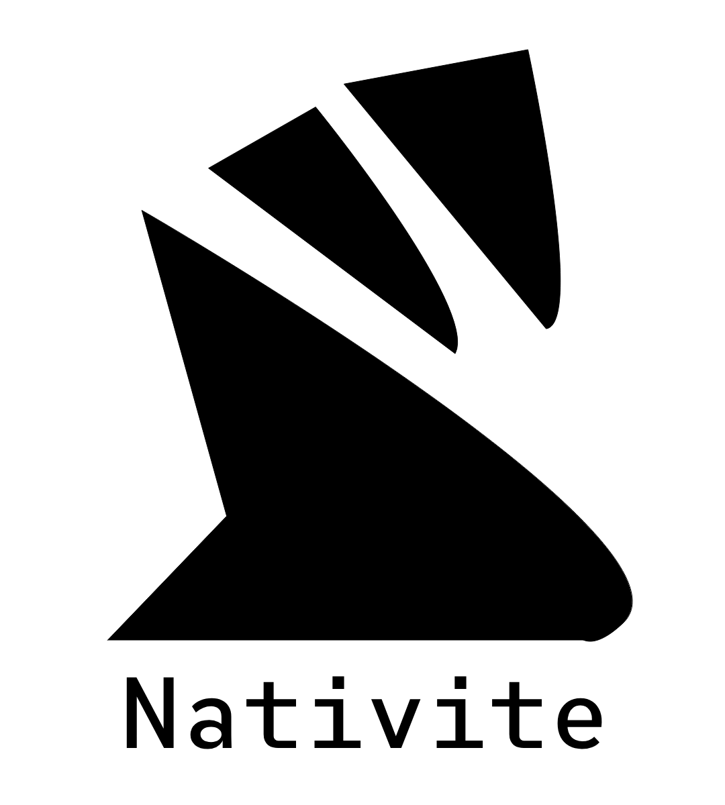

# Nativite Engine

  

---

## Description

**Nativite Engine** is a bucket database engine, a new paradigm of bio-inspired databases
based on the human brain, storing data in a new way, with **Clusters**, **Buckets** and **Astructs**,
which are the main data structures.

## What is a bucket database?

in summary of what it is, Bucket database is a new paradigm of databases that 
consists of storing data in 3D vertical stacks nested in a container of containers,
Also the largest data container is Brain, This new database paradigm is bio-inspired by
the human brain, since the input is the buckets or 3D vertical stacks and the output is
the cache or terminals.

## Main Features

Its main data storage structures are:

- **Bucket Database**: The container of several brains, the equivalent of schemas 
- **Brain**: Information unit containing several clusters or neurons, the difference is
             that the clusters are not interconnected to be more parallelizable
- **Cluster**: The equivalent of the neuron, a container of several buckets
- **Bucket**: The equivalent to dendrites, a container of 3D vertical stacks of astructs which is the minimum
              unit of information,
              they can have several vertical layers
- **Terminal**: equivalent to axons, it contains an output with the most consulted structs,
                also in the stack of most used structs, the first to enter,
                last to leave the stack, Each cluster has an output box or, more simply,
                an output. It includes automatic terminal management or cache, even if the
                automatic terminal management is activated, if the user requires it, the cache
                can also be managed even if it is activated.
- **Astruct**: The minimum unit of information, it can be any type of data, a number,
               a string, a boolean, etc.

An example of what the structure would look like:

<pre>
  BucketDatabase([
    Brain([
      Cluster([
        Bucket([
          [
            *** 3D Vertical Stacks ***
            [   
              [Astruct("Hello")],
              [Astruct(12.5)],
              [Astruct(19.289389)],
              [Astruct("a")],
              [Astruct(true)],
              [Astruct(nullptr)],
              [Astruct([1, 2, 3, 4])],
              [Astruct({"name": "John", "age": 25, "other": {...}})]
            ],
            [   
              [Astruct("World")],
              [Astruct("other")],
              [Astruct(false)],
              [Astruct("empty")],
              [Astruct(true)],
              [Astruct((1, 2, 3, 4))],
              [Astruct([[1, 2, 3, 4], [5, 6, 7, 8], [9, 10, 11, 12], [13, 14, 15, 16]])],
              [Astruct({"name": "John", "age": 25, "other": {...}})]
            ],
            *** More Stacks ***
            [
              ...
            ]
          ]
        ])
      ])
    ])
  ])
</pre>

## NOTE
3D vertical stacks do not necessarily have to be homogeneous, But in the example it
looks homogeneous just to demonstrate how the bucket database data structure
would look like.

## Progress

The engine is in the development stages, the data structures brain, cluster, bucket, terminal,
astruct, automatic terminal management are being developed, in the future authentication, http 
request management, data types, etc. will be implemented.

### NOTE:
It is mandatory to follow all the rules found on CONTRIBUTING.md. 
You must read the rules carefully before starting to contribute.

## License

This project is under the Apache License 2.0, in short what Apache License 2.0
does is a permissive license whose conditions require the preservation of copyright,
to make a fork of Nativite you have to ask the author's permission.

### Extra
- If you want to read more about Apache License 2.0, read (LICENSE.md)[./LICENSE.md]

## Thanks

Thank you for your interest in Nativite Engine. If you want to support this project, you can start contributing. If you want to know in depth how Nativite Engine works, you can read the code documentation. If you want to start contributing, you must read the [CONTRIBUTING.md](./CONTRIBUTING.md) before starting to contribute to the project.

## TODO
Implement CONTRIBUTING.md

---

Copyright © 2025 Tomascord
Under **Apache License 2.0**